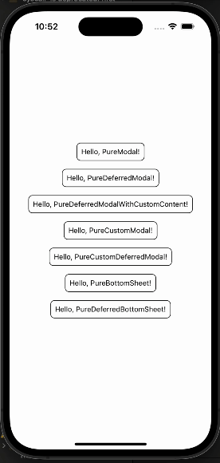

# react-native-pure-overlay

> Easy, Light, Awesome react native overlay library. Whether it's a modal, bottom sheet, alert, loading screen, or anything else you need, this library can handle it all.

react-native-pure-overlay는 최소한의 dependancy로 modal, bottom sheet, loading 등 overlay component를 선언적으로 제어하기 위해 만들어졌습니다. 모두 View, Pressable, Animated 등 react-native 내장 객체를 이용해 만들었으며, ios에서 여러가지 제약사항을 가진 Modal 컴포넌트는 사용하지 않았습니다. (현재는 Modal, BottomSheet, Loading을 지원하지만 앞으로 SnackBar, Toast 등을 추가 지원할 예정입니다.)



react-native-pure-overlay를 사용하면 더이상 매번 스크린에 모달 컴포넌트를 배치하고 visible state를 선언하고 props를 넘길 필요 없이 선언적으로 모달을 관리할 수 있습니다.

```tsx
const { openModal, closeModal } = usePureModal();

openModal({
  title: 'hello, world',
  body: 'this is pure modal',
  onPressConfirm: closeModal,
  onPressBackButton: closeModal,
});
```

또한 기본 제공하는 openDeferredModal을 통해 모달에서의 사용자 행동을 가져와 훨씬 간단하고 직관적으로 코드를 설계할 수 있습니다.

```tsx
const { openDeferredModal, closeModal } = usePureModal();

const onPressSubmit = async () => {
  const action = await openDeferredModal({
    title: 'hello, world',
    body: 'this is pure modal',
    onPressConfirm: closeModal,
    onPressBackButton: closeModal,
  });
  if (action === 'pressedConfirm') {
    Alert.alert('you should press confirm button, right?');
  }
};
```

# Installation

```
npm install @pureboard/react-native-pure-overlay

# or using yarn
yarn add @pureboard/react-native-pure-overlay
```

# Usage

## 사용할 컴포넌트 정의하기

react-native-pure-overlay는 직접 컴포넌트를 제공하는 방식이 아니라, 사용자가 원하는 컴포넌트를 Overlay Component로써 핸들링하는 인터페이스를 제공하는 라이브러리입니다. 사용자가 직접 Modal Component와 BottomSheet Component를 정의해야만 합니다.(BottomSheet의 경우 slide down으로 움직이는 컴포넌트 베이스는 제공합니다.)

```tsx
export interface CustomModalProps {
  title: string;
  body: string;
  confirmLabel: string;
  onPressConfirm: () => void;
}

const CustomModal = (props: CustomModalProps) => {
    ...
}


export interface SampleBottomSheetProps {
  title?: string;
  content?: React.ReactNode;
  onPressClose?: () => void;
  buttonLabel?: string;
  onPressButton?: () => void;
}

export const SampleBottomSheet = (props: SampleBottomSheetProps) => {
    ...
}
```

## createPureOverlay

위에서 선언한 컴포넌트를 overlayId와 함께 propTypes를 묶어 `verlayPropList` 타입으로 선언합니다. overlayId는 프로젝트에서 각 컴포넌트를 식별하는데 사용되며, 자유롭게 작명하시면 됩니다.

```tsx
export type ProjectOverlayPropList = {
  custom: CustomModalProps;
  sample: SampleBottomSheetProps;
  loading: {};
};
```

이렇게 선언한 `ProjectOverlayPropList`를 createPureOverlay에 제네릭으로 넘겨 PureOverlay 객체를 반환받고, 프로젝트 루트를 Provier로 감싸줍니다.

```tsx
import { createPureOverlay } from '@pureboard/react-native-pure-overlay';

const PureOverlay = createPureOverlay<ProjectOverlayPropList>();

const App = () => {
  return (
    <PureOverlay.Provider>
      <YourScreen />
    </PureOverlay.Provider>
  );
};
export default App;
```

## Modal

PureOverlay.Provider 하위에 PureOverlay.Modal 컴포넌트를 배치해줍니다. PureOverlay.Modal은 총 3가지 props를 지닙니다.

- Component: Modal로써 제어할 컴포넌트를 받습니다.
- resolveKeys: Component의 props 중에 openDeferredModal의 결과로써 사용자 행동을 resolve할 prop과 어떤 값으로 resovle 할것인지에 대한 정의입니다.
- overlayId: 이후 handler를 호출할 때 식별자로써 사용됩니다.

```tsx
const App = () => {
  return (
    <PureOverlay.Provider>
      <YourScreen />
      <PureOverlay.Modal
        Component={CustomModal}
        resolveKeys={{ onPressConfirm: 'pressedConfirm' }}
        overlayId={'custom'}
      />
    </PureOverlay.Provider>
  );
};
export default App;
```

<PureOverlay.Modal>로 넘겨주는 컴포넌트는 프로젝트 내부 어디서든 usePureModal hook을 호출하여 핸들링할 수 있습니다.

```tsx
import { usePureModal } from '@pureboard/react-native-pure-board';

const { openModal, openDeferredModal, closeModal } = usePureModal<
  ProjectOverlayPropList,
  'custom',
  'pressedConfirm'
>('custom');
```

openModal과 openDeferredModal은 params로 Modal Component의 props를 받으며, 모달 여백 터치에 해당하는 onPressBackDrop, 안드로이드 물리버튼에 해당하는 onPressBackButton, 모달 배경의 opacity에 해당하는 backgroundOpacity를 추가로 넘겨줄 수 있습니다.

```ts
interface BasePureModalProps {
  onPressBackButton?: () => void;
  onPressBackDrop?: () => void;
  backgroundOpacity?: number;
}

//openModal
(params: CustomModalProps & BasePureModalProps)=> void;

//openDeferredModal
(params: CustomModalProps & BasePureModalProps)=> Promise<ResovleType>;
```

```tsx
openModal({
  title: 'custom modal',
  body: 'this params will pass to CustomModal Component as props',
  confirmLabel: 'OK',
  onPressConfirm: () => {
    console.log('close modal');
    closeModal();
  },
  onPressBackButton: closeModal,
  onPressBackDrop: closeModal,
  backgroundOpacity: 0.5,
});

openDeferredModal({
  title: 'custom modal',
  body: 'this params will pass to CustomModal Component as props',
  confirmLabel: 'OK',
  onPressConfirm: () => {
    console.log('close modal');
    closeModal();
  },
  onPressBackButton: closeModal,
  onPressBackDrop: closeModal,
  backgroundOpacity: 0.5,
}).then((action) => {
  if (action === 'pressedConfirm') {
    return console.log('pressedConfirm');
  }
  if (action === 'pressedBackButton') {
    return console.log('pressedBackButton');
  }
  if (action === 'pressedBackDrop') {
    return console.log('pressedBackDrop');
  }
});
```

openDeferredModal을 사용할 때, BaseProps인 onPressBackButton은 "pressedBackButton"으로, onPressBackDrop은 "pressedBackDrop"으로 resolve됩니다. 또한, PureOverlay.Modal에 resolveKeys로 {onPressConfirm: 'pressedConfirm'}으로 바인딩 해주었기 때문에, 만약 사용자가 확인 버튼을 눌러 onPressConfirm을 호출했다면 openDeferredModal은 pressedConfirm으로 resolve 됩니다.

openDeferredModal을 사용하면 아래처럼 모달과 핵심 데이터를 주고받을 필요 없이, 모달로부터 사용자 행동을 받아와 직관적인 코드 설계가 가능해집니다.

```tsx
import { usePureModal } from "@pureboard/react-native-pure-board";

const MyScreen = () => {
  const { openDeferredModal, closeModal } = usePureModal<
    ProjectOverlayPropList,
    "custom"
  >("custom");

  const onPressRemoveItem = async () =>{
    const action = await openDeferredModal({
        title: "are you sure?",
        body: "If you press confirm, this item will remove!",
        onPressConfirm:closeModal,
        onPressBackButton:closeModal,
        onPressBackDrop:closeModal,
    })
    if(action === 'pressedConfirm'){
        removeItemMutation();
    }
  }

  return <Container>
    <Button label={'remove item'} onPress={onPressRemoveItem}>
  </Container>
};
```

## BottomSheet

```tsx
export type ProjectOverlayPropList = {
  custom: CustomModalProps;
  sample: SampleBottomSheetProps;
  loading: {};
};

const PureOverlay = createPureOverlay<ProjectOverlayPropList>();

const App = () => {
  return (
    <PureOverlay.Provider>
      <MainScreen />
      <PureOverlay.BottomSheet
        Component={SampleBottomSheet}
        resolveKeys={{
          onPressButton: 'pressedButton',
          onPressClose: 'pressedCloseButton',
        }}
        overlayId={'sample'}
      />
    </PureOverlay.Provider>
  );
};
export default App;
```

BottomSheet도 전체적으로 Modal과 동일합니다. resolveKeys를 통해 BottomSheet Component Props와 resolve key를 바인딩할 수 있습니다.

이렇게 주입한 BottomSheet는 openPureBottomSheet hook을 통해 핸들링할 수 있습니다.

```tsx
const { openBottomSheet, openDeferredBottomSheet, closeBottomSheet } =
  usePureBottomSheet<
    ProjectOverlayPropList,
    'sample',
    'pressedButton' | 'pressedCloseButton'
  >('sample');

const openSampleBottomSheet = () => {
  openBottomSheet({
    title: 'Hello, Pure!',
    onPressBackDrop: closeBottomSheet,
    onPressClose: closeBottomSheet,
    content: 'this is normal bottom sheet',
  });
};

const openSampleDeferredBottomSheet = async () => {
  const action = await openDeferredBottomSheet({
    title: 'Hello, PureDeferredBottomSheet!',
    onPressBackDrop: closeBottomSheet,
    onPressBackButton: closeBottomSheet,
    buttonLabel: 'resolve!',
    onPressButton: closeBottomSheet,
  });

  Alert.alert(action);
};
```

openBottomSheet와 openDeferredBottomSheet는 미리 선언한 BottomSheetProps 이외에 몇가지 BaseProps를 추가로 넘겨줄 수 있다.

```tsx
interface BasePureBottomSheetProps {
  onPressBackDrop?: () => void;
  onPressBackButton?: () => void;
  backgroundOpacity?: number;
  fullScreen?: boolean;
  containerStyle?: StyleProp<ViewStyle>;
}

//openBottomSheet
(params: SampleBottomSheetProps & BasePureBottomSheetProps)=> void;

//openDeferredBottomSheet
(params: SampleBottomSheetProps & BasePureBottomSheetProps)=> Promise<ResovleType>;
```

## Loading

PureOverlay.Loading은 Component를 optional하게 받으며, 아무것도 넘기지않을 경우 기본적으로 ActivityActivity가 화면 중앙에 렌더링됩니다.

```tsx
export type ProjectOverlayPropList = {
  custom: CustomModalProps;
  sample: SampleBottomSheetProps;
  loading: {};
  viewLoading: ViewProps;
};

const PureOverlay = createPureOverlay<ProjectOverlayPropList>();

const App = () => {
  return (
    <PureOverlay.Provider>
      <MainScreen />
      <PureOverlay.Loading overlayId={'loading'} />
      <PureOverlay.Loading Component={View} overlayId={'viewLoading'} />
    </PureOverlay.Provider>
  );
};
export default App;
```

PureOverlay.Loading으로 주입한 Loading Overlay는 usePureLoading hook으로 핸들링할 수 있습니다.

```tsx
const { showLoading, hideLoading } = usePureLoading<
  ProjectOverlayPropList,
  'loading'
>('loading');

const handleLoading = () => {
  showLoading();
  setTimeout(hideLoading, 5000);
};
```

showLoading의 params를 통해 Compoenent에 props를 넘길 수 있으며, 추가로 backgroundOpacity를 넘겨줄 수 있습니다.

```tsx
const { showLoading, hideLoading } = usePureLoading<
  ProjectOverlayPropList,
  'viewLoading'
>('viewLoading');

const handleLoading = () => {
  showLoading({
    style: {
      width: 100,
      heigth: 100,
      borderRadius: 50,
      backgroundColor: 'green',
    },
    backgroundOpacity: 0.5,
  });
  setTimeout(hideLoading, 5000);
};
```
